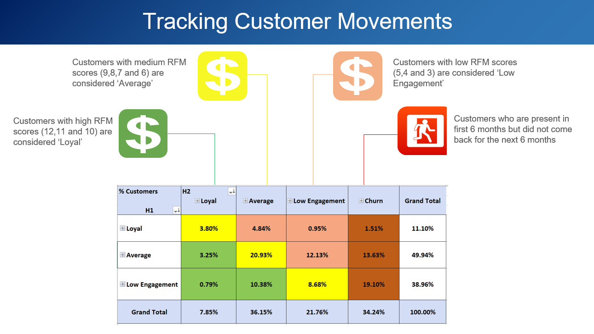

# Targeted-Marketing-Strategy

# Introduction
This project was done for the Marketing Analytics course work under the guidance of [Prof. Garret Sonnier](https://www.mccombs.utexas.edu/Directory/Profiles/Sonnier-Garrett) 
The goal of this project was to formulate marketing and budgeting strategies for a UK based non-store online retail firm which mainly sells unique all-occasion gifts and whose customers are mostly wholesalers. We achieved this by predicting the per capita revenue of a target segment of customers arrived from RFM analysis and developing product suggestions for them using association rules (market basket analysis)

# Data Overview
This is a transactional data set which contains all of the firm's transactions between 01/12/2010 and 09/12/2011. It was taken from the [online retail dataset](https://www.kaggle.com/jihyeseo/online-retail-data-set-from-uci-ml-repo) from publicly available UCI Machine Learning repository. Below mentioned are the key attributes from the data:

•	Invoice number 
•	Stock Code: Product (item) code 
•	Description: Product (item) name 
•	Quantity 
•	Invoice date and time 
•	Unit Price 
•	Customer ID 
•	Country name

# Approach
•	Split the data in two parts (6-months each) and removed the transactions which had negative quantities (Returns) 
•	Considered the first 6 months (Dec’10 – May’11) data to get the RFM segments of the customers 
•	Did k-means clustering to split the customers into R, F & M clusters and using these 6-month RFM clusters, we predicted the revenues from the customer for the next 6 months 
•	Analyzed customer movements between the RFM clusters from the first and last 6-months to identify our target group 
•	Recommended products using market basket analysis to boost the sales 

# Results and recommendations
•	We need better marketing strategy to retain customers falling in the “Average” bucket 
•	Targeting the customers, we identified to be dropping by 30% in sales, would maximize the benefits 
•	We can offer them highly affined products as bundles to attract them back to the site
